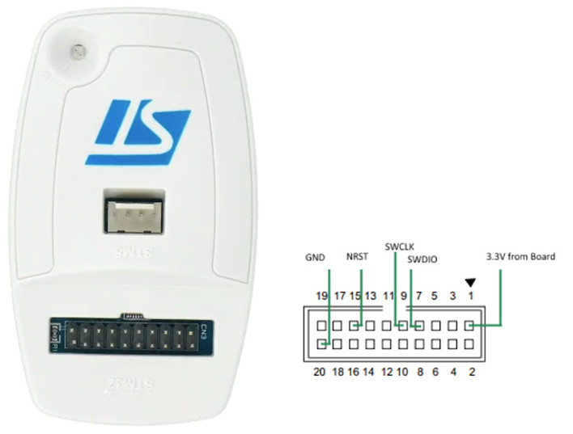

Este programa se ha compilado con la versión 4.1.1 del gestor de placas RUI3 para Arduino.

Para grabarlo en el nodo TTNMAD_DOOR seguir estos pasos:

* Compilar el programa con Arduino IDE
* Localizar el archivo BIN en la carpeta C:\Users\[miusuario]\AppData\Local\Temp\arduino\sketches\XXXX\ttnmad_door_rui3.ino.bin
* Utilizar STM32Programmer y un ST-LINK para grabar el programa BIN a partir de la dirección 0x08006000
* Programar con STEM32Programmer el bootloader de RUI3 (hay 2 versiones del RAK3172, una que termina en T y es más reciente, y otra que no contiene la T; cada una requiere un bootloader diferente), para que al arrancar el nodo derive la ejecución a la posición 0x08006000. Véase https://docs.rakwireless.com/product-categories/wisduo/rak3172-module/quickstart/#upgrade-the-firmware. Se recomienda descargar en formato HEX (en lugar de en formato BIN) porque este formato incluye la información sobre las posiciones de memoria.

El consumo en estado dormido es aproximadamente 7uA a 3V.

