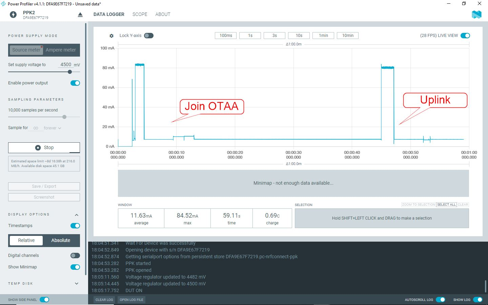

TTNMAD_EASY es un nodo diseñado para facilitar el aprendizaje de los conceptos básicos de LoRaWAN e Inteligencia artificial en el borde.

Está basado en el microcontrolador RAK3172, que puede programarse directamente con Arduino de uno de estos dos modos:

* Usando el core STMDuino: https://github.com/stm32duino/BoardManagerFiles/raw/main/package_stmicroelectronics_index.json
* Usando el core RAK para microcontroladores STM: https://raw.githubusercontent.com/RAKWireless/RAKwireless-Arduino-BSP-Index/main/package_rakwireless.com_rui_index.json

Para programarlo desde el IDE de Arduino con el core STMDuino necesitaremos un ST-Link V2 original o clónico. El original tiene un precio de unos 20€, mientras que los clónicos pueden encontrarse por unos 2-5€ en tiendas como Aliespress, eBay o Amazon. También puede programarse con un adaptador USB a Serial, pero se perderá el bootloader de RAK RUI3 y si posteriormente quisiéramos restituirlo necesitaráimos igualmente un ST-Link.

Para programarlo desde el IDE de Arduino con el core RAK necesitaremos un adaptador USB a Serial con lógica de 3.3V. Estos dispositivos suelen estar basados en los circuitos integrados CH340G o FT232RL, y pueden encontrarse por unos 2-5€ en tiendas como Aliexpress, eBay o Amazon.

Más información en la presentación disponible en este mismo repositorio:

https://github.com/IoTopenTech/myIoTopenTech/blob/master/TiposDeDispositivos/TTNMAD_EASY/ttnmad_easy.pdf

TTNMAD_EASY dispone de:

* 2 Botones
* 2 LEDs
* Un acelerómetro LIS3DH
* Todos los pines expuestos en pin headers
* Alimentación mediante 3 baterías AAA o mediante conector USB Tipo C
* Conversor de tensión XC6215B332 de muy baja corriente de fuga

En la carpeta GERBER se encuentran los archivo necesarios para encargar la fabricación del PCB.

En la carpeta EJEMPLOS hay algunos programas básicos.

La lista de materiales para su fabricación es la siguiente:

| Id | Identificador | Paquete | Cantidad | Identificación | 
|----|---------------|---------|----------|----------------|
| 1 | R4,R7,R8 | R_0805_2012Metric_Pad1.20x1.40mm_HandSolder | 3 | 4.7k | 
| 2 | C1,C2,C4 | C_0805_2012Metric_Pad1.18x1.45mm_HandSolder | 3 | 100n | 
| 3 | U3 | SOT-23-5 | 1 | XC6215B332MR | 
| 4 | R10,R5,R12,R9 | R_0805_2012Metric_Pad1.20x1.40mm_HandSolder | 4 | 10k | 
| 5 | D3,D1,D2 | LED_1206_3216Metric_Pad1.42x1.75mm_HandSolder | 3 | LED | 
| 6 | U1 | rak3172 | 1 | rak3172 | 
| 7 | JP1,JP2 | SolderJumper-2_P1.3mm_Open_RoundedPad1.0x1.5mm | 2 | SolderJumper_2_Open | 
| 8 | NTC1 | R_Axial_DIN0204_L3.6mm_D1.6mm_P2.54mm_Vertical | 1 | Thermistor_NTC | 
| 9 | J1 | PinHeader_1x05_P2.54mm_Vertical | 1 | Conn_01x05 | 
| 10 | J3,J2,J11 | PinHeader_1x06_P2.54mm_Vertical | 3 | Conn_01x06 | 
| 11 | C5 | C_0805_2012Metric_Pad1.18x1.45mm_HandSolder | 1 | 10u | 
| 12 | RESET1,BOTON2,BOTON1 | tact_6mm | 3 | SW_SPST | 
| 13 | R6 | R_0805_2012Metric_Pad1.20x1.40mm_HandSolder | 1 | 8.2k | 
| 14 | R2,R1,R11 | R_0805_2012Metric_Pad1.20x1.40mm_HandSolder | 3 | 100ohm | 
| 15 | C3 | C_0805_2012Metric_Pad1.18x1.45mm_HandSolder | 1 | 1u | 
| 16 | J7 | PinSocket_1x13_P2.54mm_Vertical_SMD_Pin1Left | 1 | Conn_01x13 | 
| 17 | AE1 | TestPoint_THTPad_D2.5mm_Drill1.2mm | 1 | Antenna | 
| 18 | J5,J9 | PinHeader_1x08_P2.54mm_Vertical | 2 | Conn_01x06 | 
| 19 | SW1 | slide_switch_dpdt_smd | 1 | SW_Push_DPDT | 
| 20 | J4 | PinHeader_1x04_P2.54mm_Vertical | 1 | HTU21D | 
| 21 | U5 | SC-70-8_Handsoldering | 1 | tps2116 | 
| 22 | J8 | PinSocket_1x14_P2.54mm_Vertical_SMD_Pin1Left | 1 | Conn_01x14 | 
| 23 | U2 | LGA-16_3x3mm_P0.5mm_LayoutBorder3x5y | 1 | LIS3DH | 
| 24 | U4 | usb_c_6_pin | 1 | usb_c_6_pin_jfmateos | 
| 25 | R3 | R_LDR_4.9x4.2mm_P2.54mm_Vertical | 1 | R_Photo | 
| 26 | BT1 | BatteryHolder_Keystone_2479_3xAAA | 1 | Battery | 
| 27 |  | Antena externa LoRaWAN | 1 |  | 

TTNMAD_Easy no está optimizado para lograr un consumo mínimo (es una herramienta didáctica). En la siguiente imagen pueden observarse que el consumo medio

